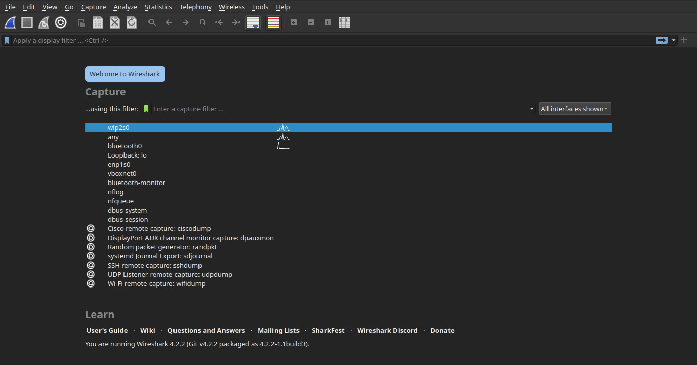
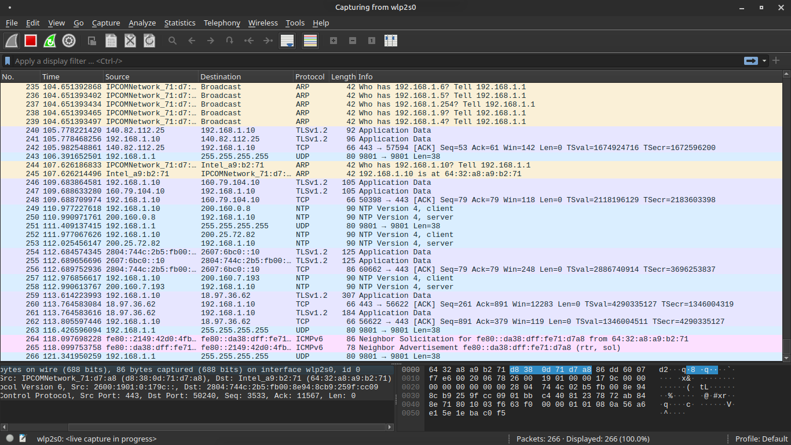
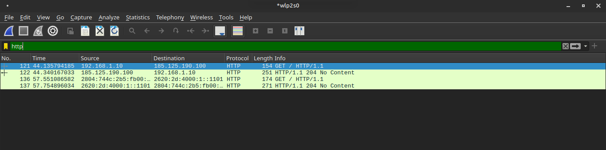
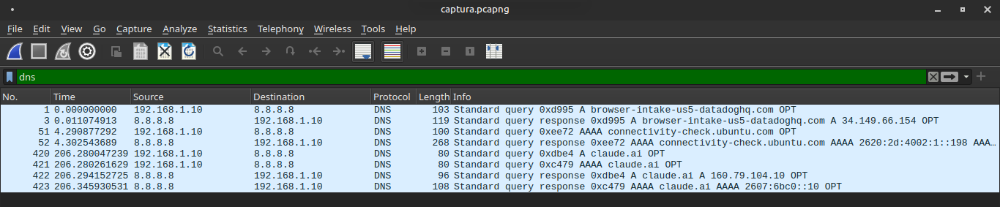
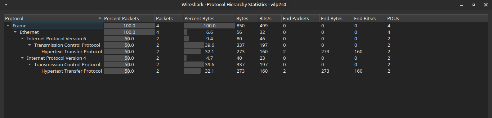
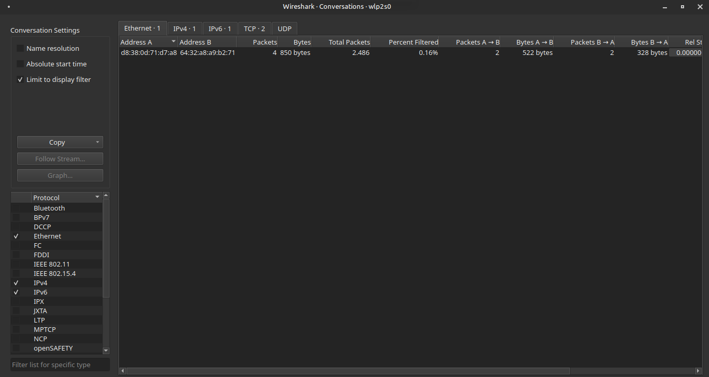
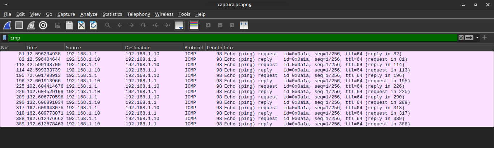
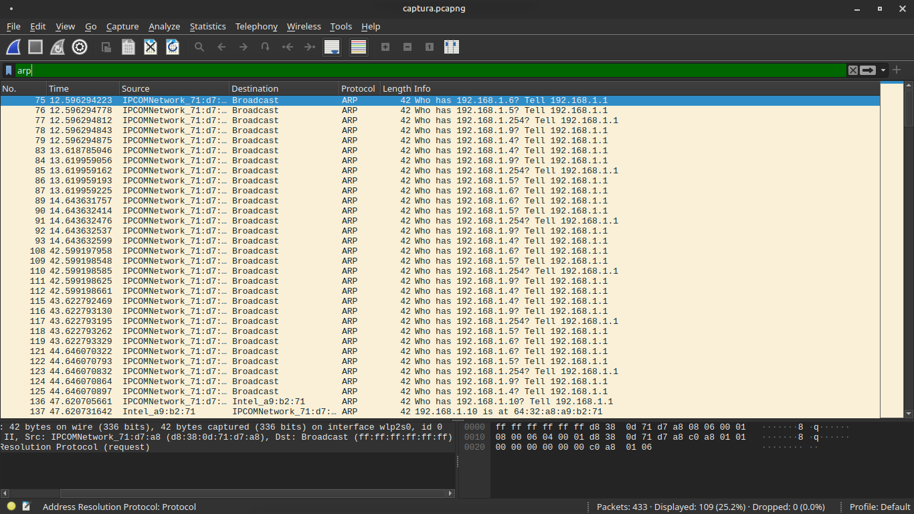
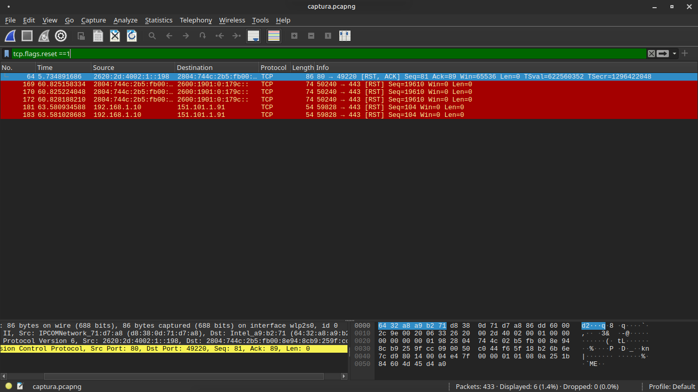

# 🔍 Network Traffic Monitoring com Wireshark

> Análise prática de tráfego de rede para identificação de padrões, protocolos e comportamentos — fundamento essencial para Blue Team e SOC.

---

## 📋 Índice

- [Ambiente](#ambiente)
- [Instalação do Wireshark](#instalação-do-wireshark)
- [Captura de Pacotes](#captura-de-pacotes)
- [Análise de Protocolos](#análise-de-protocolos)
- [Padrões de Comunicação](#padrões-de-comunicação)
- [Análise de Comportamento e Baseline](#análise-de-comportamento-e-baseline)
- [Conclusão](#conclusão)
- [Próximos Passos](#próximos-passos)
- [Tecnologias](#tecnologias)

---

## 1️⃣ Ambiente

| Componente | Detalhe |
|---|---|
| 🖥️ Sistema Operacional | Linux Mint (baseado em Ubuntu) |
| 🛠️ Ferramenta principal | Wireshark |
| 🌐 Interface monitorada | `wlp2s0` |

---

## 2️⃣ Instalação do Wireshark

```bash
sudo apt update
sudo apt install wireshark -y

# Adicionar usuário ao grupo wireshark (captura sem root)
sudo usermod -aG wireshark $USER
```

> ⚠️ **Importante:** Após adicionar ao grupo, reinicie a sessão para que as permissões sejam aplicadas corretamente.



---

## 3️⃣ Captura de Pacotes

**Configuração da captura:**

- Interface selecionada: `wlp2s0`
- Duração: ~2 minutos
- Tráfego gerado por navegação real durante a captura

```
Wireshark → Selecionar interface → ▶ Start
```



---

## 4️⃣ Análise de Protocolos

Filtros utilizados para isolar tipos de tráfego:

| Protocolo | Filtro Wireshark | Finalidade |
|---|---|---|
| HTTP | `http` | Requisições web não criptografadas |
| DNS | `dns` | Resolução de nomes de domínio |
| ICMP | `icmp` | Testes de conectividade (ping) |
| IP específico | `ip.addr == 192.168.x.x` | Isolar um host na rede |





---

## 5️⃣ Padrões de Comunicação

### Protocol Hierarchy

Visão geral dos protocolos mais utilizados durante a captura:

```
Statistics → Protocol Hierarchy
```



### Conversations

IPs com maior volume de comunicação identificados em:

```
Statistics → Conversations
```



---

## 6️⃣ Análise de Comportamento e Baseline

Durante a captura, foram analisados padrões de tráfego com foco na identificação de possíveis anomalias.

### 🔍 Resultados da análise

- ✅ Tráfego DNS consistente com navegação legítima

  

- ✅ Pacotes ICMP gerados manualmente (testes de conectividade)

  

- ✅ Pacotes ARP dentro do comportamento esperado da rede local

  

- ✅ Conexões TCP reset (RST) observadas sem padrão suspeito ou repetitivo

  

### 🧠 Conclusão técnica

Não foram identificados indícios de:

- ❌ Varredura de rede (port scan)
- ❌ Comunicação com domínios suspeitos
- ❌ Tentativas de exploração
- ❌ Exfiltração de dados

> 👉 O comportamento observado está alinhado com um ambiente controlado e uso legítimo da rede.
>
> Este processo é fundamental para estabelecer um **baseline de tráfego**, que permite identificar desvios em cenários reais de incidente.

---

## 7️⃣ Conclusão

| Resultado | Status |
|---|---|
| Captura de pacotes realizada | ✅ |
| Protocolos identificados e filtrados | ✅ |
| Padrões de comunicação mapeados | ✅ |
| Baseline de comportamento estabelecido | ✅ |
| Nenhuma anomalia relevante identificada | ✅ |

> 🔍 Este projeto demonstra na prática como funciona a análise de tráfego de rede — habilidade fundamental para atuação em **Blue Team**, **SOC** e **Segurança da Informação**.

---

## 🔮 Próximos Passos

- [ ] Simular tráfego malicioso com Nmap
- [ ] Identificar padrões de varredura de rede (scan)
- [ ] Analisar possíveis tentativas de intrusão
- [ ] Criar cenários de detecção de anomalias reais
- [ ] Evoluir para monitoramento contínuo com alertas

---

## 🛠️ Tecnologias


---
