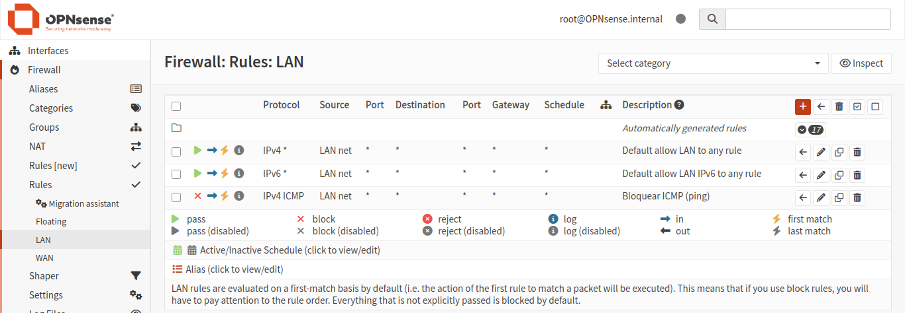
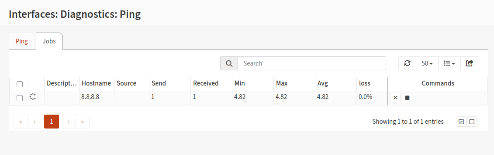
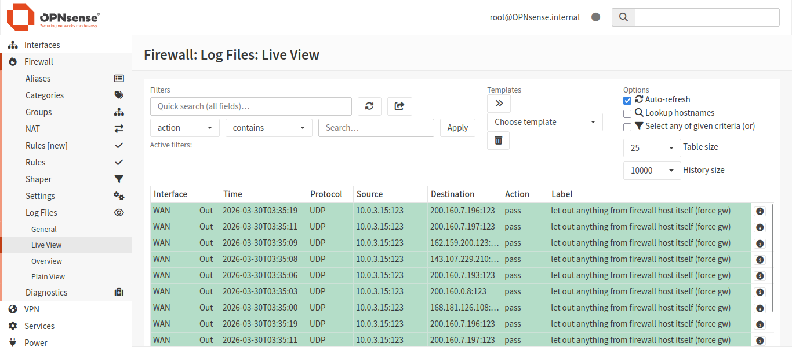

# Nível 2 — Regras de Firewall

## Objetivo
Criar regras de controle de tráfego no OPNsense, entendendo
como o firewall decide o que bloquear e o que permitir.

## Regras criadas
- Regra: Block ICMP from LAN net to any  
  Descrição: bloqueia pacotes ICMP (ping) saindo da rede LAN para qualquer destino.

## Impacto das Regras 
- Impede diagnóstico de rede via ICMP, reduzindo a exposição a varreduras simples de rede.

## Prints

**Regras da interface LAN:**

**Teste de ping via Diagnostics:**

**Log do firewall:**

## O que eu aprendi
As regras de firewall são processadas de cima pra baixo,
 a primeira regra que bater no tráfego é a que vale.

Aprendi também que regras da LAN controlam tráfego originado
dentro da rede interna. Em um ambiente de lab com recursos
limitados, sem uma VM cliente separada na LAN, os testes
foram validados via logs e diagnósticos do próprio OPNsense.

Isso me mostrou que entender o escopo de cada regra
(em qual interface ela atua e em qual direção) é fundamental
para configurar um firewall corretamente.
